# Hello there,👋

---

### 🛰️ Live Contribution Scan

---

### Hack The Box

---

### 👋 About me

I'm **Resego Mokgopa**, a cybersecurity professional working across penetration testing, web application security, and SOC operations.
- Active CTF competitor
- I do some web development as well :)

---

### 🛠️ Skills

**Languages**

**Frameworks**

**Database**

**Security**

---

### 📊 GitHub Stats

---

### 💼 Featured Projects

**Security & CTF**

| Project | Description | Stack | Status |
|---|---|---|---|
| [PNPT-Report-Generator](https://github.com/Cyb3rM0n4rch/YOUR-REPO) | Programmatic PNPT-style pentest report generation | Python · python-docx | 🔵 Active |

**Web & Full-Stack**

| Project | Description | Stack | Status |
|---|---|---|---|
| [Portfolio](https://github.com/Cyb3rM0n4rch/YOUR-REPO) | Personal security/dev portfolio site | Next.js · TypeScript · Three.js | 🔵 Active |

---

### 📫 Connect

